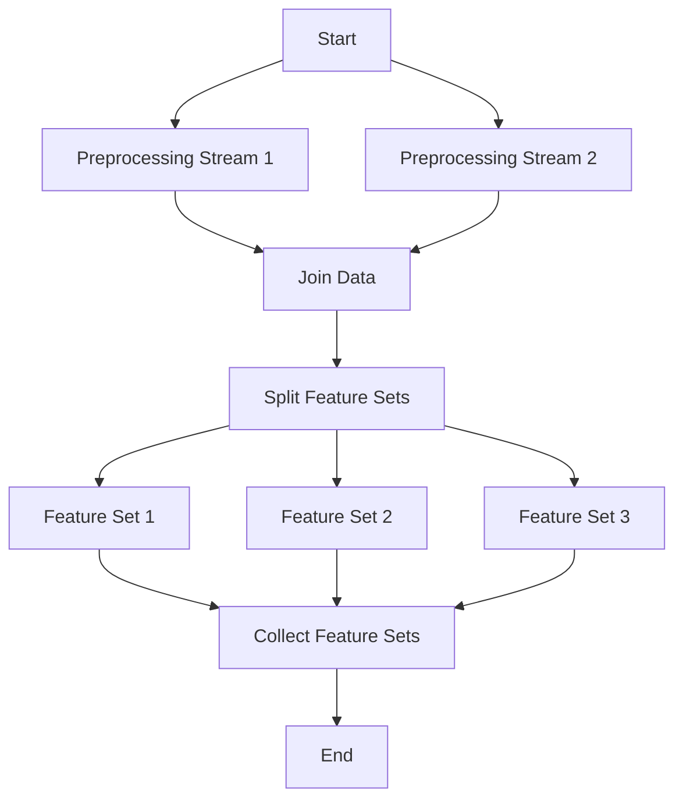
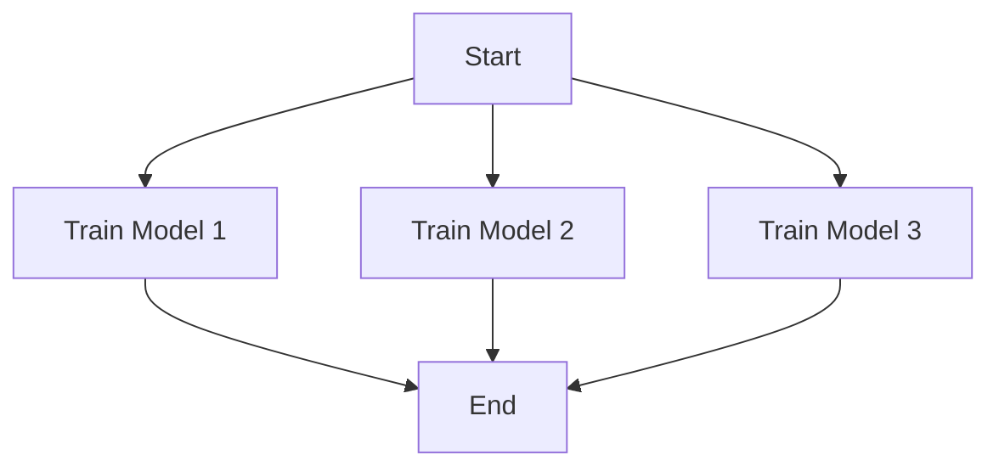

It is recommended to define which dataset version(s) for the raw input are used in the `start` step.
If storage/memory footprint is too high, then serialize and deserialize artifacts manually between the steps instead of using `.self` for versioning.

Dataset | Train/Valid=